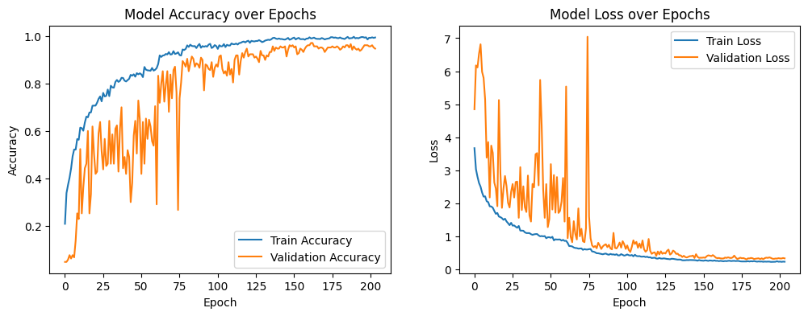
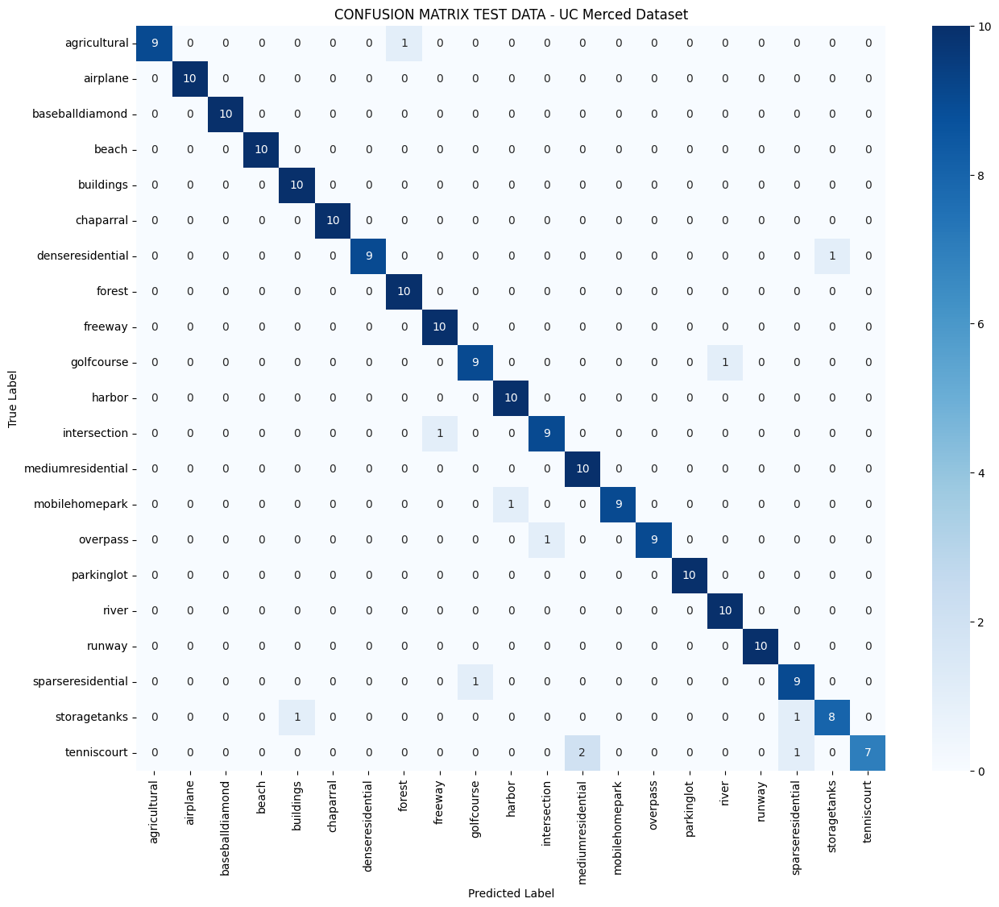

# Improved Training – Experiment B (UC Merced LandUse)

## Objective
Improve the baseline CNN by iteratively modifying architecture and training strategy.

## Baseline reference
- `notebooks/cnn_baseline_ucmerced.ipynb`

## Experiment notebooks
- B1: `notebooks/cnn_B1_architecture.ipynb`
- B2: `notebooks/cnn_B2_regularization.ipynb`
- B3: `notebooks/cnn_B3_callbacks.ipynb`

---

## B1 – Architecture enhancement
- Filters increased: 32/64/128 → 64/128/256
- L2 regularization (Conv + Dense)
- Global Average Pooling instead of Flatten
- Max epochs: 500 with EarlyStopping

## B2 – Regularization tuning
- L2: Conv λ=0.0005, Dense λ=0.001
- Dropout: 0.2 (Conv), 0.3 (Dense)
- Adam optimizer (lr=1e-3)
- EarlyStopping (patience=15)
- ReduceLROnPlateau (patience=7)

## B3 – Callback refinement (final)
- No architecture changes
- EarlyStopping patience: 25
- ReduceLROnPlateau patience: 12

## Status
B3 is selected as the final improved training configuration.
Quantitative results will be reported after evaluation.
## Results – Final configuration (B3)

### Training summary
- Maximum epochs: 500
- Epoch where training stopped (EarlyStopping): **204**
- Final learning rate: **1e-5**

### Final evaluation metrics
| Split | Accuracy |
|---|---:|
| Train | **100.00%** |
| Validation | **95.71%** |
| Test | **94.29%** |

### Classification performance (test set)
- Overall accuracy: **96%**
- Macro-average F1-score: **0.96**
- Weighted-average F1-score: **0.96**

### Class-wise behavior
- All classes achieved at least **90% accuracy**.
- Multiple classes reached **100% accuracy**, including:
  agricultural, airplane, baseballdiamond, beach, buildings, chaparral,
  forest, freeway, golfcourse, harbor, intersection, mediumresidential,
  mobilehomepark, parkinglot, river, runway, sparseresidential, tenniscourt.

### Observations
- The improved model shows a substantial performance gain compared to the baseline,
  especially in validation and test accuracy.
- Training convergence is smoother and more stable than in previous iterations.
- Increasing model depth combined with L2 regularization and Global Average Pooling
  significantly improves generalization.
- Extending callback patience in B3 allows the optimizer to better refine convergence
  without introducing overfitting.

### Conclusion
Experiment B confirms that progressive architectural refinement and training strategy
optimization lead to a robust and high-performing CNN model. Configuration B3 is selected
as the final improved model for subsequent explainability and robustness analyses.

---

## Figures (B3)

### Training curves

### Confusion matrix (test set)

